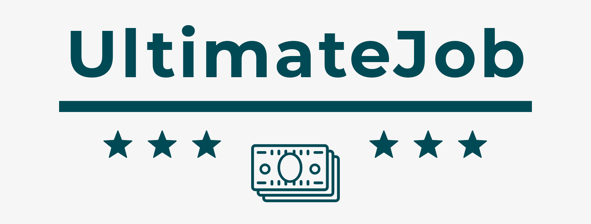

# **UltimateJob.com - Job Search Engine**

## **Main Goal**

UltimateJob.com is an open-source platform that aspires to help people find their ULTIMATE job,
tailored to their capabilities.
We combine the most coveted jobs online to one platform, from Facebook, RedHat & Amazon's official Careers page.

## Project Architecture :fire:
The project runs on Vagrant VM (Fedora) & uses Django as a web framework.
bootstrap.sh file is triggered when the app starts running and it creates the project env.

#### **Frontend**
Client UI to register, login, and view available jobs.  
<u>Languages</u>- HTML, CSS

#### **Backend**
Information extractor scripts (API) using Soup Web Scrape urls, extract the relevant information and places it into the required DB. 
<u>Language</u>- Python

#### **Database**
MySQL relational database, stored in the cloud. 
<u>ORM</u>- SQLAlchemy

### Functionalities:

- Sign in & sign up
- Algorithm for search engine by criteria
- Saved jobs list

### How it works: :tada:

1. Main page website with sign-in/ sign up
2. Profile creation with job preferences
3. Database that contains all the users and their preferences, and one with all pulled jobs
4. A backend that pulled participating companies' career websites for search matches

## UJ Team :family:

- Rom Tamam
- Bar Ben Naim  
- Omer Nuri
- Erez Lavor
